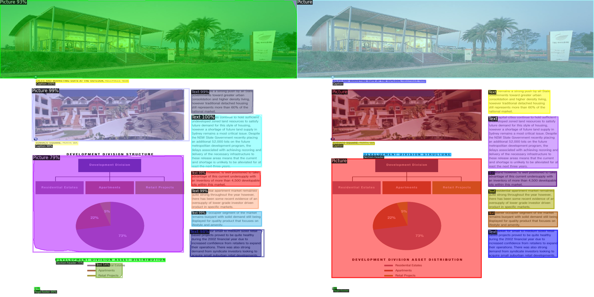
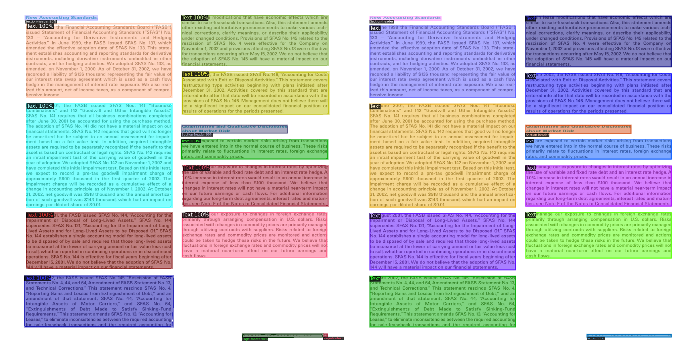
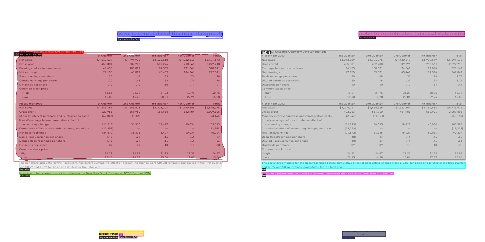
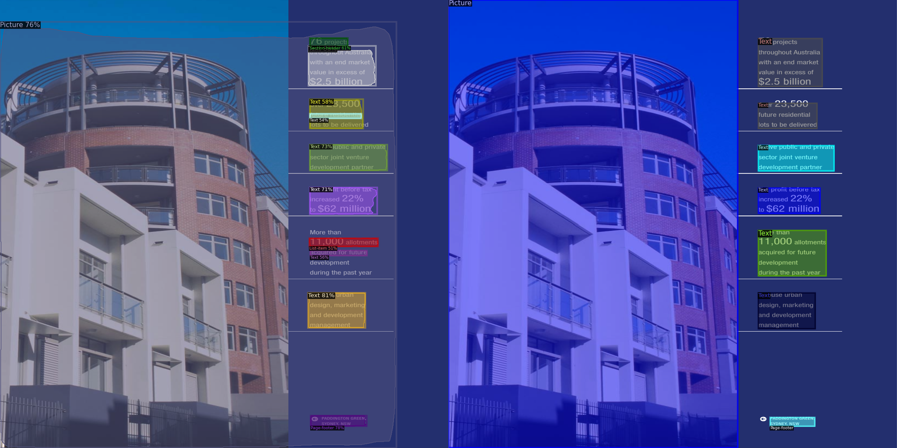

# SwinDocSegmenter

## Description
Pytorch implementation of the paper [SwinDocSegmenter: An End-to-End Unified Domain Adaptive Transformer for Document Instance Segmentation](https://arxiv.org/abs/2305.04609). This model is implemented on top of the [detectron2](https://github.com/facebookresearch/detectron2) framework. The proposed model can be used to analysis the complex layouts including [magazines](https://www.primaresearch.org/datasets/Layout_Analysis), [Scientific Reports](https://github.com/ibm-aur-nlp/PubLayNet), [historical documents](https://dell-research-harvard.github.io/HJDataset/), [patents](https://github.com/DS4SD/DocLayNet) and so on as shown in the following examples.

<table style="padding:10px">
    <tr>
        <td style="text-align:center">
            Magazines 
        </td>
        <td style="text-align:center">
            Scientific Reports 
        </td>
    </tr>
    <tr>
        <td style="text-align:center"> 
            
        </td>
        <td style="text-align:center">
            
        </td>
    </tr>
    <tr>
        <td style="text-align:center">
            Tables 
        </td>
        <td style="text-align:center">
            Others 
        </td>
    </tr>
    <tr>
        <td style="text-align:center"> 
            
        </td>
        <td style="text-align:center">
            
        </td>
    </tr>

</table>

# Getting Started 

### Step 1: Clone this repository and change directory to repository root
```bash
git clone https://github.com/ayanban011/SwinDocSegmenter.git 
cd SwinDocSegmenter
```

### Step 2: Setup and activate the conda environment with required dependencies:
follow the [installation instructions](https://github.com/ayanban011/SwinDocSegmenter/edit/main/INSTALL.md)

### Step 3: For testing our model, download the best pretrained model weights from the **Model Zoo**

```bash
python ./train_net.py \
    --config-file maskdino_R50_bs16_50ep_4s_dowsample1_2048.yaml \
    --eval-only \
    --num-gpus 1 \
    MODEL.WEIGHTS ./model_final.pth
```
### Step 4: For training the model from scratch, use this magic command for training on 'n' GPUs:
```bash
python train_net.py --num-gpus 1 --config-file config_path SOLVER.IMS_PER_BATCH SET_TO_SOME_REASONABLE_VALUE SOLVER.BASE_LR SET_TO_SOME_REASONABLE_VALUE
```
### Step 4: For training the model from scratch, use this magic command for training on 'n' GPUs:
In ```train_net.py```
```bash
def main(args):
    register_coco_instances("dataset_train",{},"path to the ground truth json file","path to the training image folder")
    register_coco_instances("dataset_val",{},"path to the ground truth json file","path to the validation image folder")

    MetadataCatalog.get("dataset_train").thing_classes = ['name of the classes']
    MetadataCatalog.get("dataset_val").thing_classes = ['name of the classes']
    ...
if __name__ == "__main__":
    ...
    MetadataCatalog.get("dataset_train").thing_classes = ['name of the classes']
    MetadataCatalog.get("dataset_val").thing_classes = ['name of the classes']
    ...
```
In ```Config File```
```bash
...
SEM_SEG_HEAD:
    ...
    NUM_CLASSES: #no. of classes
...
DATASETS:
  TRAIN: ("dataset_train",)
  TEST: ("dataset_val",)
...
```

## Model Zoo
In this section, we release the pre-trained weights for all the best DocEnTr model variants trained on benchmark datasets.

<table class="tg">
<thead>
  <tr>
    <th class="tg-amwm"><span style="font-style:normal;text-decoration:none;color:#000;background-color:transparent">Dataset</span></th>
    <th class="tg-amwm"><span style="font-style:normal;text-decoration:none;color:#000;background-color:transparent">Config-file</span></th>
    <th class="tg-amwm"><span style="font-style:normal;text-decoration:none;color:#000;background-color:transparent">Weights</span></th>
    <th class="tg-amwm"><span style="font-style:normal;text-decoration:none;color:#000;background-color:transparent">AP</span></th>
  </tr>
</thead>
<tbody>
  <tr>
    <td class="tg-baqh"><span style="font-weight:400;font-style:normal;text-decoration:none;color:#000;background-color:transparent">PublayNet</span></td>
    <td class="tg-baqh"><span style="font-weight:400;font-style:normal;text-decoration:none;color:#000;background-color:transparent"><a href=https://github.com/ayanban011/SwinDocSegmenter/blob/main/configs/coco/instance-segmentation/maskdino_R50_bs16_50ep_4s_dowsample1_2048.yaml>config-publay</a></span></td>
    <td class="tg-baqh"><span style="font-weight:400;font-style:normal;text-decoration:none;color:#000;background-color:transparent"><a href=https://drive.google.com/file/d/1DCxG2MCza_z-yB3bLcaVvVR4Jik00Ecq/view?usp=share_link>model</a></span></td>
    <td class="tg-baqh"><span style="font-weight:400;font-style:normal;text-decoration:none;color:#000;background-color:transparent">93.72</span></td>
  </tr>
  <tr>
    <td class="tg-baqh"><span style="font-weight:400;font-style:normal;text-decoration:none;color:#000;background-color:transparent">Prima</span></td>
    <td class="tg-baqh"><span style="font-weight:400;font-style:normal;text-decoration:none;color:#000;background-color:transparent"><a href=https://github.com/ayanban011/SwinDocSegmenter/blob/main/configs/coco/instance-segmentation/maskdino_R50_bs16_50ep_4s_dowsample1_2048.yaml>config-prima</a></span></td>
    <td class="tg-baqh"><span style="font-weight:400;font-style:normal;text-decoration:none;color:#000;background-color:transparent"><a href=https://drive.google.com/file/d/1DNX9HQ0aG5ws0HCTFBUeV__rTlifNsvq/view?usp=share_link>model</a></span></td>
    <td class="tg-baqh"><span style="font-weight:400;font-style:normal;text-decoration:none;color:#000;background-color:transparent">54.39</span></td>
  </tr>
  <tr>
    <td class="tg-baqh"><span style="font-weight:400;font-style:normal;text-decoration:none;color:#000;background-color:transparent">HJ Dataset</span></td>
    <td class="tg-baqh"><span style="font-weight:400;font-style:normal;text-decoration:none;color:#000;background-color:transparent"><a href=https://github.com/ayanban011/SwinDocSegmenter/blob/main/configs/coco/instance-segmentation/maskdino_R50_bs16_50ep_4s_dowsample1_2048.yaml>config-hj</a></span></td>
    <td class="tg-baqh"><span style="font-weight:400;font-style:normal;text-decoration:none;color:#000;background-color:transparent"><a href=https://drive.google.com/file/d/1DNX9HQ0aG5ws0HCTFBUeV__rTlifNsvq/view?usp=share_link>model</a></span></td>
    <td class="tg-baqh"><span style="font-weight:400;font-style:normal;text-decoration:none;color:#000;background-color:transparent">84.65</span></td>
  </tr>
  <tr>
    <td class="tg-baqh"><span style="font-weight:400;font-style:normal;text-decoration:none;color:#000;background-color:transparent">TableBank</span></td>
    <td class="tg-baqh"><span style="font-weight:400;font-style:normal;text-decoration:none;color:#000;background-color:transparent"><a href=https://github.com/ayanban011/SwinDocSegmenter/blob/main/configs/coco/instance-segmentation/maskdino_R50_bs16_50ep_4s_dowsample1_2048.yaml>config-table</a></span></td>
    <td class="tg-baqh"><span style="font-weight:400;font-style:normal;text-decoration:none;color:#000;background-color:transparent"><a href=https://drive.google.com/file/d/17DD9ASe3p3nLGEYhNCG0hbTURg8qNakC/view?usp=share_link>model</a></span></td>
    <td class="tg-baqh"><span style="font-weight:400;font-style:normal;text-decoration:none;color:#000;background-color:transparent">98.04</span></td>
  </tr>
  <tr>
    <td class="tg-baqh"><span style="font-weight:400;font-style:normal;text-decoration:none;color:#000;background-color:transparent">DoclayNet</span></td>
    <td class="tg-baqh"><span style="font-weight:400;font-style:normal;text-decoration:none;color:#000;background-color:transparent"><a href=https://github.com/ayanban011/SwinDocSegmenter/blob/main/configs/coco/instance-segmentation/maskdino_R50_bs16_50ep_4s_dowsample1_2048.yaml>config-doclay</a></span></td>
    <td class="tg-baqh"><span style="font-weight:400;font-style:normal;text-decoration:none;color:#000;background-color:transparent"><a href=https://drive.google.com/file/d/1kMUnmdliyWWlXV9L8gQGvmS-h_mkM_mR/view?usp=share_link>model</a></span></td>
    <td class="tg-baqh"><span style="font-weight:400;font-style:normal;text-decoration:none;color:#000;background-color:transparent">76.85</span></td>
  </tr>
</tbody>
</table>

## Citation

If you find this useful for your research, please cite it as follows:

```bash
@article{banerjee2023swindocsegmenter,
  title={SwinDocSegmenter: An End-to-End Unified Domain Adaptive Transformer for Document Instance Segmentation},
  author={Banerjee, Ayan and Biswas, Sanket and Llad{\'o}s, Josep and Pal, Umapada},
  journal={arXiv preprint arXiv:2305.04609},
  year={2023}
}
```

## Acknowledgement

Many thanks to these excellent opensource projects 
* [MaskDINO](https://github.com/IDEA-Research/MaskDINO) 
* [DINO](https://github.com/IDEA-Research/DINO)


## Authors
- [Ayan Banerjee](https://github.com/ayanban011)
- [Sanket Biswas](https://github.com/biswassanket)
## Conclusion
Thank you for your interest in our work, and sorry if there are any bugs.

